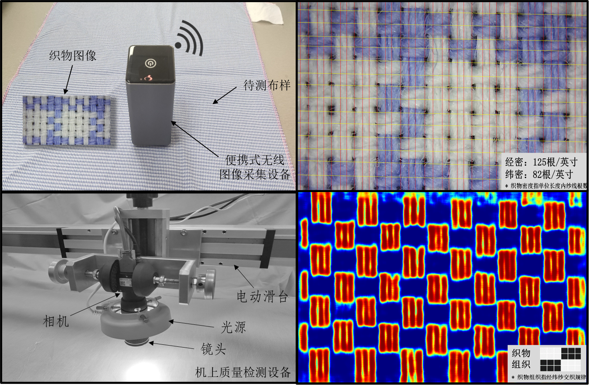
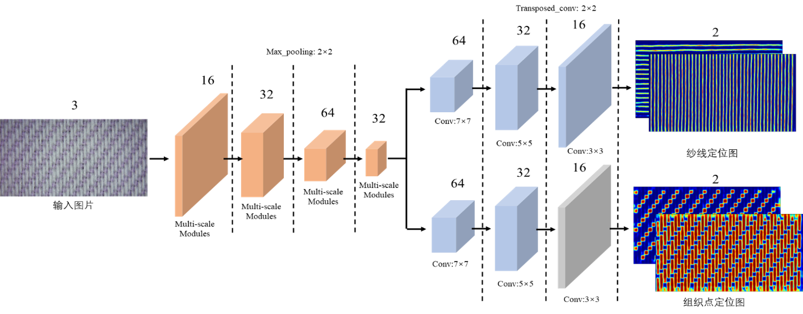

# MTMSnet for the Recognition of Fabric Structure Parameters 
This is the repo for the recognition of fabric structure paramers, including fabric density measurement, weave pattern recognition, color pattern recognition




## Papers

[Shuo Meng, Ruru Pan, Weidong Gao, Jian Zhou, Jingan Wang, Wentao He. A multi-task and multi-scale convolutional neural network for automatic recognition of woven fabric pattern. Journal of Intelligent Manufacturing.](https://doi.org/10.1007/s10845-020-01607-9)

[Shuo Meng, Jingan Wang, Ruru Pan, Weidong Gao, Jian Zhou, Wentao He. Recognition of the layout of colored yarns in yarn-dyed fabrics. Textile Research Journal.]( https://doi.org/10.1177/0040517520932830)

[Shuo Meng, Ruru Pan, Weidong Gao, Jian Zhou, Jingan Wang, Wentao He. Woven Fabric Density Measurement by Using Multi-Scale Convolutional Neural Networks. IEEE Access.]( https://doi.org/10.1109/ACCESS.2019.2922502)

## Usage
### Requirements
```
Python3
Keras 2.2.4 with Tensorflow 1.13.0 as backend. 
```
### Dataset
The preparation of the Dataset can be found in our paper.


## Citation
If this repo for helps you, please cite our papers. Thank you!
